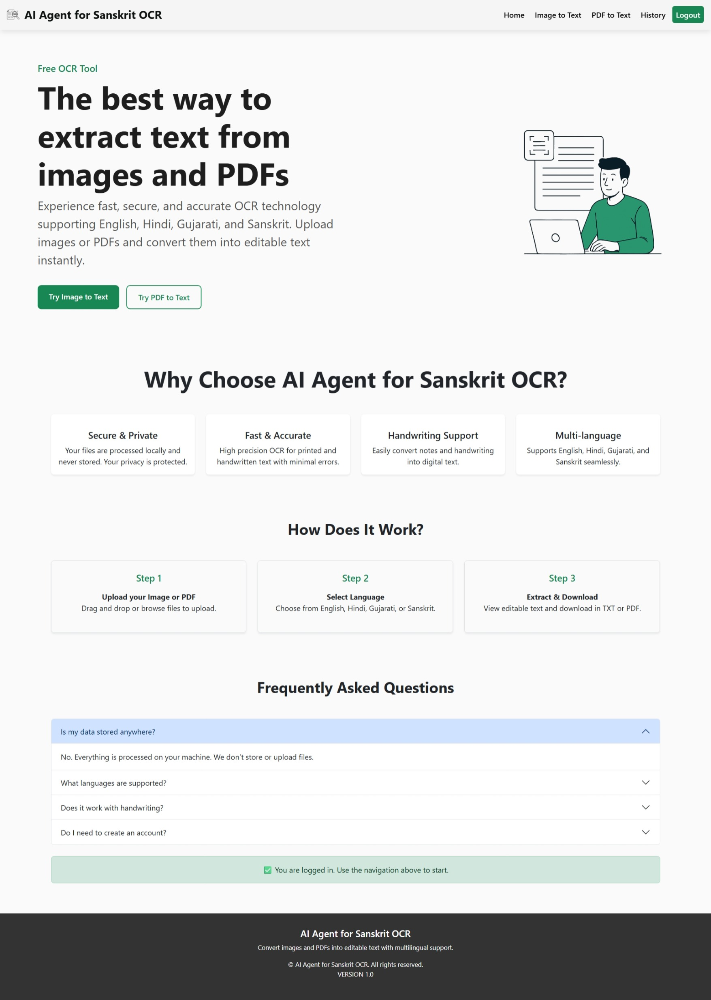
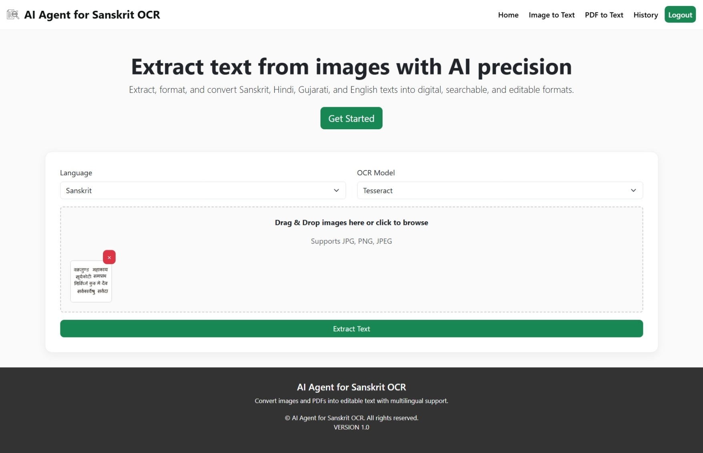
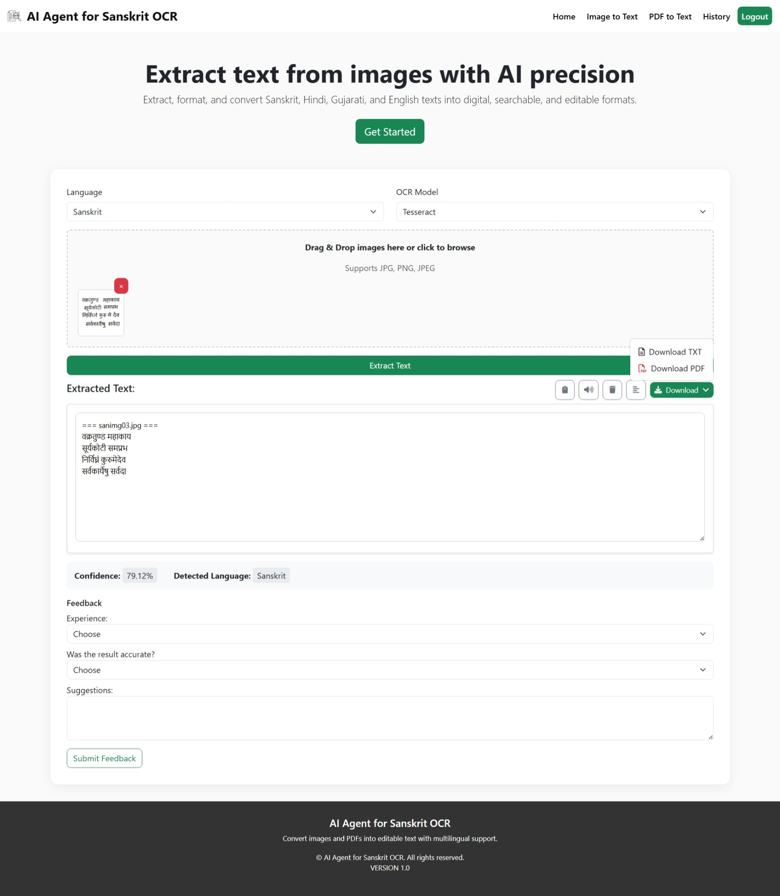
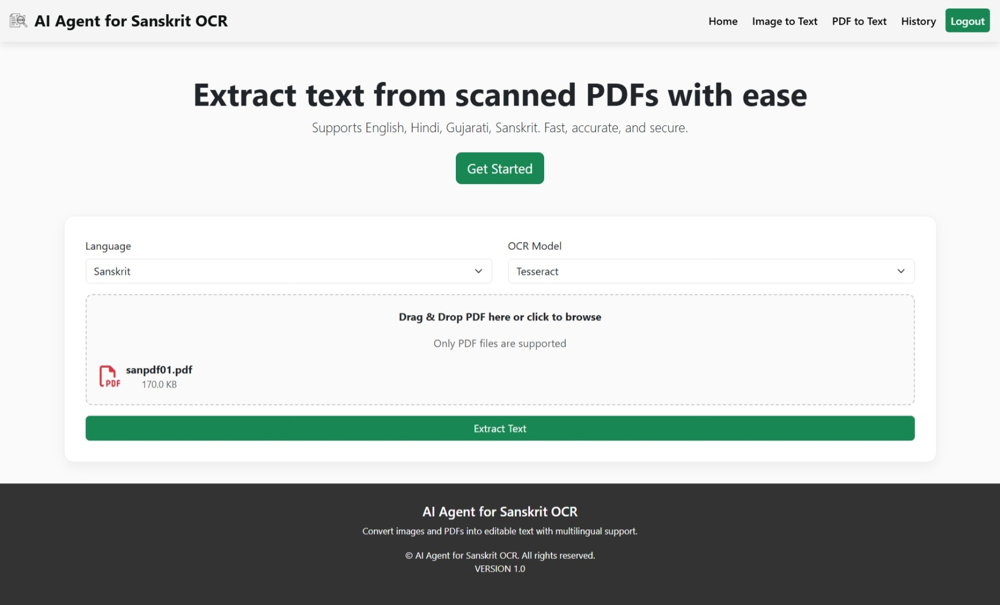
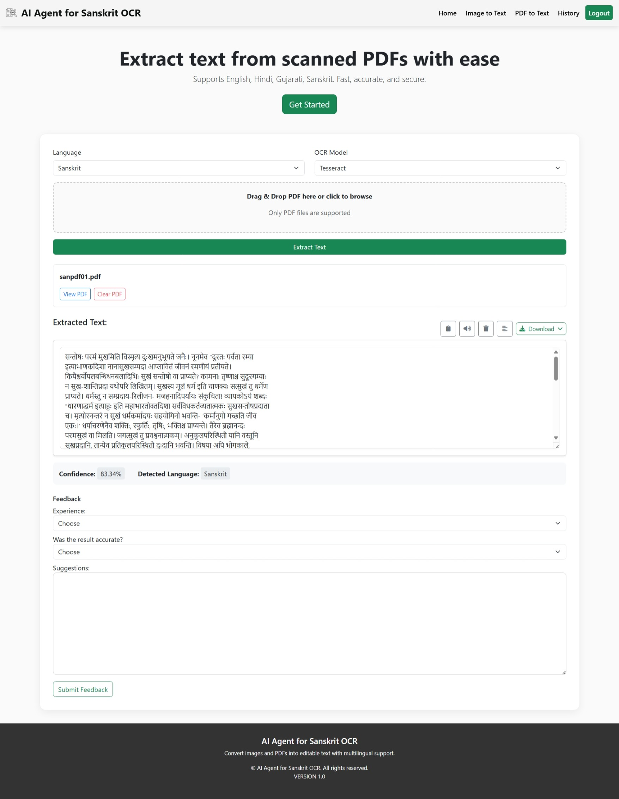

<div align="center">

# AI Agent for OCR

Intelligent Document Understanding with Vision & Language Models

[](#)
[](#)
[](#)
[](#license)
[](#)

</div>

---

### Table of Contents

- [Overview](#overview)
- [Key Features](#key-features)
- [Demo / Screenshots](#demo--screenshots)
- [Tech Stack](#tech-stack)
- [Architecture](#architecture)
- [Roadmap](#roadmap)
- [License](#license)
- [Contact](#contact)

---

## Overview

AI Agent for OCR is a full‑stack Django application that extracts clean, editable text from images and PDFs with multi‑language support. It blends classic OCR (Tesseract) with modern LLM tooling to improve text quality, add metadata, and streamline export and review workflows. An admin panel provides visibility into OCR requests, feedback analytics, and system health.

Use cases include digitizing documents, processing forms, multilingual text extraction, and building searchable archives.

## Key Features

- Multi‑input support: images (PNG/JPG) and PDFs
- Multi‑language OCR: English, Hindi, Gujarati, Sanskrit (extensible)
- Smart text cleanup and formatting (LLM‑assisted pipeline ready)
- Export: TXT, DOCX, and PDF options
- Admin Panel: Dashboard, OCR Logs, User Feedback, Settings
- Feedback analytics: average accuracy and experience scores
- User session tracking and audit logs
- Pluggable OCR backends (Tesseract by default; API hooks for cloud OCR)
- Rate limiting, basic logging, and history retention

## Demo / Screenshots

### Home Page
  


---

### Image to Text Conversion
  
_Users can upload images or PDFs and choose OCR language._

---

### Image to Text Result
  
_Extracted text preview with copy/download options._

---

### Image to PDF Conversion
  
_Converts uploaded images into editable, searchable PDF files._

---

### Image to PDF Result 
  
_Extracted text preview with copy/download options._

---

## Tech Stack

- Backend: Python, Django 4.x
- Database: MySQL
- OCR: Tesseract OCR (`pytesseract`) with language packs (`eng`, `hin`, `guj`, `san`)
- Frontend: HTML, CSS, JavaScript (no SPA framework required)
- Optional AI/LLM: OpenAI API / LangChain (placeholders; integrate as needed)
- Utilities: Pillow, PyPDF2/pdfplumber, python‑docx, reportlab

## Architecture

- Input → Validation → OCR (Tesseract) → Post‑processing (cleanup/LLM) → Output
- Django views handle uploads and orchestration
- MySQL stores users, OCR logs, and feedback
- Admin Panel surfaces metrics and history

```text
Client (Web UI)
   ↓ upload
Django View
   ↓ route
OCR Service (Tesseract)
   ↓ text
Post‑processor (LLM / cleanup)
   ↓ formatted text
Storage (DB + Files) → Admin Panel / Downloads
```

## Roadmap

- Add GPU‑accelerated OCR and table extraction
- Integrate cloud OCR (Google Vision, Azure, AWS Textract)
- Add LLM‑based post‑correction and summarization
- Role‑based access control and audit trails
- Advanced analytics and export to CSV/Parquet

## License

This project is licensed under the MIT License. See the [LICENSE](LICENSE) file for details.

## Contact

- GitHub: `https://github.com/Buildwith.18`
- Email: buildwith.18@gmail.com

—

If this project helps you, consider ⭐ starring the repository!


